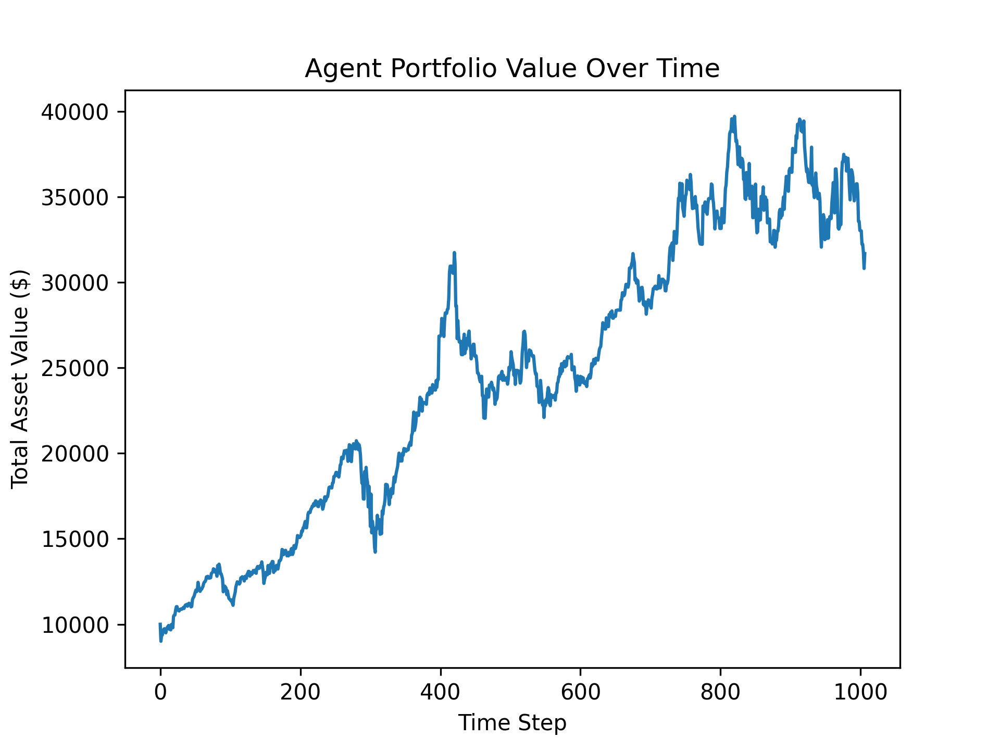
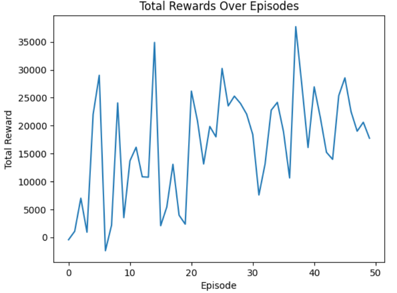

# 📈 Deep Q-Network (DQN)-Based Stock Trading Agent

This project implements a reinforcement learning agent using **Deep Q-Networks (DQN)** to learn and execute stock trading strategies. The agent is trained on historical stock data from **Yahoo Finance**, using a custom **OpenAI Gym** environment.

---

## 🚀 Features

- ✅ Custom OpenAI Gym environment for trading simulation  
- 📊 Data sourcing via **Yahoo Finance API**  
- 🧠 DQN agent with PyTorch-based neural network  
- 🔄 Experience replay and target networks  
- 💰 Dynamic portfolio tracking (cash + stock value)  
- 📈 Performance plots for rewards and portfolio value  
- 🔒 Dropout regularization to improve generalization  

---

## 🧠 How It Works

1. **State Space** includes stock price, balance, and stock holdings  
2. **Actions**: Buy, Sell, or Hold  
3. **Reward**: Change in total portfolio value  
4. **Q-Network**: Predicts expected future rewards for each action  
5. Agent is trained over episodes to maximize cumulative reward

---

